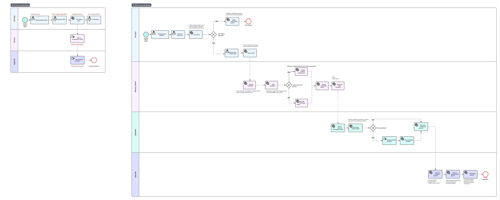

# Məsafəyə Əsaslanan Avtobus Gediş Haqqı Sistemi

## Layihə haqqında

2 km və 18 km yol gedən sərnişin eyni gediş haqqını ödəməlidirmi?

Bu Business Analysis case study-si mövcud sabit tarif modelini təhlil edir və gediş haqqının faktiki məsafəyə əsasən hesablandığı alternativ sistem təklif edir.

## Problem

Sabit tarif modeli:

* Qısa və uzun səfərlər arasında qiymət uyğunsuzluğu yaradır.
* Sərnişinlərin minmə və enmə nöqtələrini qeydə almır.
* Marşrut gəlirliliyinin ölçülməsini çətinləşdirir.
* Resurs və marşrut planlamasını real məlumatlarla dəstəkləmir.

## Təklif olunan həll

Sərnişin avtobusa minərkən `tap-in`, enərkən isə `tap-out` edir. Sistem GPS vasitəsilə qət edilən məsafəni müəyyənləşdirir və gediş haqqını avtomatik hesablayır.

Həllə həmçinin balans yoxlanılması, güzəştli tariflər, transfer qaydaları, elektron qəbz, offline rejim və fraud monitorinqi daxildir.

## Mənim rolum

IT Biznes Analitik kimi:

* AS-IS və TO-BE proseslərini modelləşdirdim.
* Stakeholder analizi və RACI Matrix hazırladım.
* Stakeholder müsahibə suallarını müəyyənləşdirdim.
* Biznes, funksional və qeyri-funksional tələbləri sənədləşdirdim.
* Requirements Traceability Matrix qurdum.
* Edge case, risk və fərziyyələri təhlil etdim.

## Proses modeli

## Layihə sənədləri

| Sənəd                              | Orijinal fayl                                           | PDF versiyası                                         |
| ---------------------------------- | ------------------------------------------------------- | ----------------------------------------------------- |
| Mövcud prosesin analizi            | [Word faylı](https://docs.google.com/document/d/1JqVcDvxxCE1gt8EwD7UM05C87j-SCr3xz3J1xLG9m_Y/edit?usp=share_link)          | [PDF-də bax](01_Current_Process_Analysis.pdf)         |
| Stakeholder analizi və RACI Matrix | [Excel faylı](https://docs.google.com/spreadsheets/d/1NmJRZR0KmWYjnzHggfxzF9HoG_R35itP/edit?usp=share_link&ouid=116434697923266657001&rtpof=true&sd=true)             | [PDF-də bax](02_Stakeholder_Analysis.pdf)             |
| Stakeholder sualları               | [Word faylı](https://docs.google.com/document/d/1dLZVW4cy71SPCmtWMWcJerUv9o5uaH-aQfFfRMerl7I/edit?usp=share_link)             | [PDF-də bax](03_Stakeholder_Questions.pdf)            |
| AS-IS və TO-BE proses modeli       | [Şəkilə bax](04_AsIs_ToBe_Process.png)                  | —                                                     |
| Requirements Traceability Matrix   | [Excel faylı](https://docs.google.com/spreadsheets/d/1-Jd-W4IrwSqAWyTADc83emAJabu6BjYt/edit?usp=share_link&ouid=116434697923266657001&rtpof=true&sd=true) | [PDF-də bax](05_Requirements_Traceability_Matrix.pdf) |
| Edge Case Analysis                 | [Excel faylı]((https://docs.google.com/spreadsheets/d/1H9zteD5qL1adyXg9rq4ib22g6uu0DAH8OesFKimBMb4/edit?usp=share_link))                       | [PDF-də bax](06_Edge_Cases.pdf)                       |
| Risk və Assumption Log             | [Excel faylı](https://docs.google.com/spreadsheets/d/1kLtNVg4lDHStgixTEowKh2wmMZC_WRHS/edit?usp=share_link&ouid=116434697923266657001&rtpof=true&sd=true))             | [PDF-də bax](07_Risk_Assumptions_Log.pdf)             |

## İstifadə edilən bacarıqlar

`Business Analysis` · `BPMN` · `AS-IS / TO-BE` · `Stakeholder Analysis` · `RACI` · `Requirements Engineering` · `Traceability` · `Risk Analysis`

---

**Hazırlayan:** Nazrin Askarzada
**Rol:** IT Business Analyst

> Bu, şəxsi portfolio üçün hazırlanmış konseptual case study-dir və real qurumun rəsmi layihəsini təmsil etmir.
